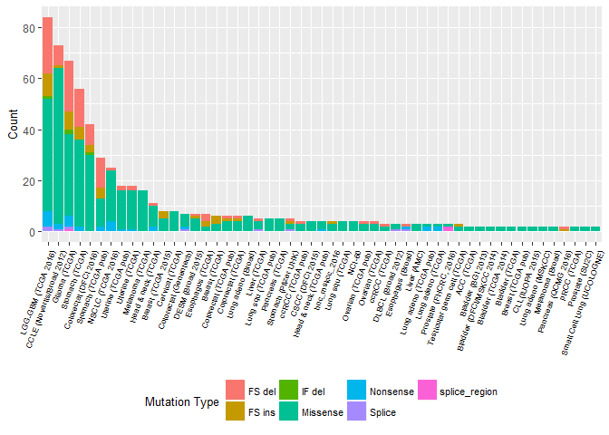
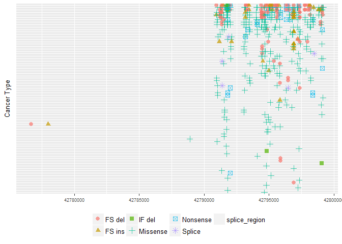

tcgaR
=====

------------------------------------------------------------------------

This is a very simple package for gaining basic insight on cancer associated genes through TCGA data. Data must be downloaded from [cbioportal](http://www.cbioportal.org/). Before going into the packages usages, here are the instructions for getting data from cbioportal.

**1. Query cbioportal for a gene of interest (required action indicated by red circles). If you want to try other genes but don't know any, BRCA1, KRAS, and KMT2D are some other known cancer associated genes.**


**2. Download mutation tsv under the mutations tab from cbioportal (click on download on the bottom of the page)**


If you're not familiar with genetics
====================================

------------------------------------------------------------------------

**Cancer is a disease hallmarked by many mutations that vary greatly across cancer types. It can be informative to visualize the mutations in a gene that you are interested in studying across other cancer types to see their contribution towards cancer as a whole and to generate hypotheses on their mechanism.**

Installation
============

------------------------------------------------------------------------

``` r
library(devtools)
```

    ## Warning: package 'devtools' was built under R version 3.3.2

``` r
#install_github("slee94/tcgaR")
```

Package Usage
=============

------------------------------------------------------------------------

read\_cbioportal() takes in cbioportal data (specifically, the mutation table) and produces a nice data frame that contains the information we are interested in.

``` r
library(tcgaR)
library(tidyverse)
```

    ## Warning: package 'ggplot2' was built under R version 3.3.2

``` r
CIC_data <- read_cbioportal("mutation_table_CIC.tsv")
knitr::kable(head(CIC_data, 10))
```

| cancer\_study              | mut\_type |    n\_pos|
|:---------------------------|:----------|---------:|
| Glioma (TCGA)              | Missense  |  42799060|
| Glioma (TCGA)              | Missense  |  42791715|
| LGG-GBM (TCGA 2016)        | Missense  |  42791715|
| LGG-GBM (TCGA 2016)        | Missense  |  42791715|
| LGG-GBM (TCGA 2016)        | Missense  |  42791715|
| LGG-GBM (TCGA 2016)        | Missense  |  42791715|
| LGG-GBM (TCGA 2016)        | Splice    |  42791393|
| Glioma (TCGA)              | Missense  |  42791758|
| LGG-GBM (TCGA 2016)        | Missense  |  42791806|
| CCLE (Novartis/Broad 2012) | Splice    |  42791603|

plot\_mut\_freq() plots the frequency of mutations found in each cancer type. This allows us to assess the importance of our gene of interest in the pathologies of different cancer types.

``` r
plot_mut_freq(CIC_data)
```



Here we see that CIC is prevalently mutated in gliomas and stomach cancers (CCLE is cell line data), suggesting that these cancers are driven by mutations in CIC.

plot\_mut\_dist() plots the distribution of mutations that occur along the length of the gene. This may inform us on the nature of the contribution of our gene towards specific cancers. For example, if we see a very spread out distribution vs a localized distribution, it may indicate that the cancer progresses upon **losing** the function of our gene.

``` r
plot_mut_dist(CIC_data)
```

    ## Warning: The shape palette can deal with a maximum of 6 discrete values
    ## because more than 6 becomes difficult to discriminate; you have 7.
    ## Consider specifying shapes manually if you must have them.

    ## Warning: Removed 3 rows containing missing values (geom_point).



Here we see two mutations found further upstream than the rest of the mutations, perhaps it would be better to drop these two to get a better view of the rest. Otherwise, the mutations seem to be fairly spread out suggesting that the CIC gene normally suppresses tumour progression.

Progress Report
===============

------------------------------------------------------------------------

Unfortunately, I was not able to incorporate a gene model above the mutation distribution plot due to an error beyond my understanding with the namespace unable to import some object from the Homo.sapiens package. Other than that issue, I completed the assignment with little difficulty. Learning how to make an R package was interesting, though I doubt I would ever have to implement this during the course of my research.
